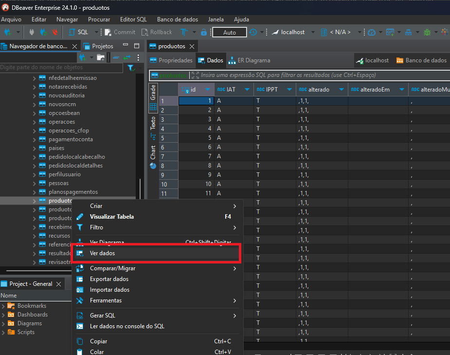
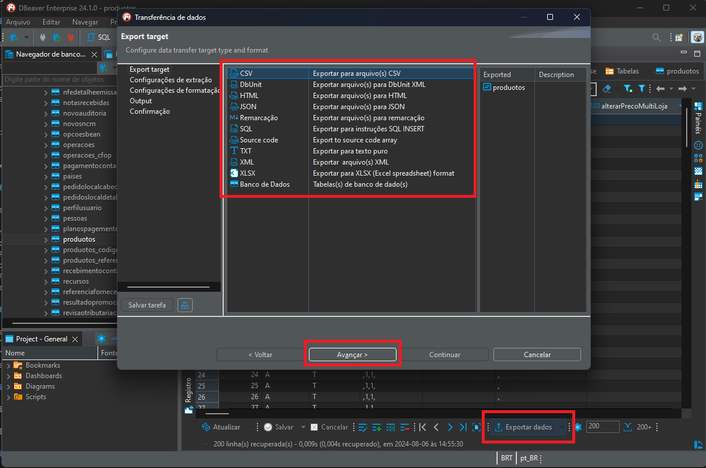
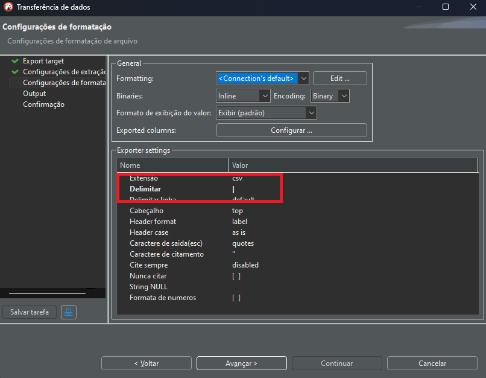
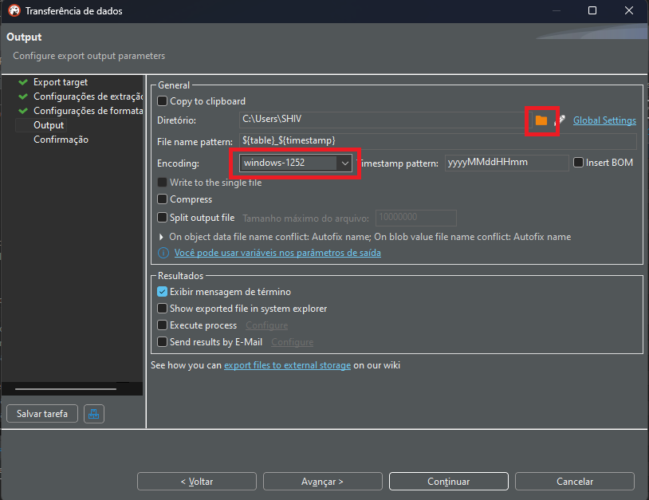

# Documentação para Exportar Dados do DBeaver

Esta documentação descreve o processo passo a passo para exportar dados de uma tabela no DBeaver para diferentes formatos de arquivo.

## Passo 1: Abrir o DBeaver

1. Inicie o DBeaver no seu computador.

## Passo 2: Conectar-se ao Banco de Dados

1. Na aba "Database Navigator", expanda a conexão do banco de dados desejado.
2. Navegue até a tabela que você deseja exportar.
3. Clique com o botão direito do mouse na tabela e selecione "View Data" ou "Ver Dados" para visualizar os dados da tabela.

## Passo 3: Exportar Dados

1. Com os dados da tabela abertos, clique com o botão direito em qualquer lugar da visualização de dados.
2. Selecione "Export Data" ou "Exportar Dados".

## Passo 4: Configurar a Exportação

1. Uma janela de exportação será aberta.
2. Na aba "Data Extractor", escolha o formato de exportação desejado, como CSV, SQL, JSON, XML, ou XLSX.
   - **CSV**: Arquivo separado por vírgulas.
   - **SQL**: Script SQL para inserções.
   - **JSON**: Formato JSON.
   - **XML**: Formato XML.
   - **XLSX**: Formato Excel.

- Instruções Adicionais:
    - Como Exportar em `CSV` no `DBeaver`? Prossiga com a documentação.
    - Como importar `CSV` no `Excel`? [Clique aqui](/docs/Importação/CSV.md).
    - Como Importar o `Excel` no `MySQL-Front`? [Clique aqui](/docs/Importação/MySQL-Front.md).*

3. Clique em "Next" ou "Avançar".

4. Avance novamente e irá mostar a seguinte tela: 

- Em Delimitar, mude o caractere `,` (Vírgula) por `|` (barra vertical). Isso será útil para diferenciar caracteres quando for importar novamente para o Excel.

## Passo 5: Configurar o Destino do Arquivo

1. Escolha o destino do arquivo:
   - Clique em "Browse" para escolher o local de salvamento e o nome do arquivo.
   - Altere o Encoding para `windows-1252`.
2. Clique em "Next" ou "Avançar".
3. Clique em "Continue" ou "Continuar".

## Passo 6: Verificar o Arquivo Exportado

1. Navegue até o local onde você salvou o arquivo exportado.
2. Abra o arquivo com um editor de texto ou um programa apropriado para verificar se os dados foram exportados corretamente.

## Dicas Adicionais

- **Filtros**: Se desejar exportar apenas um subconjunto dos dados, você pode aplicar filtros antes de iniciar o processo de exportação.
- **SQL Editor**: Para exportar resultados de uma consulta específica, você pode executar a consulta no SQL Editor e seguir os mesmos passos para exportar os resultados da consulta.

Seguindo esses passos, você conseguirá exportar dados do DBeaver de forma eficiente para o formato de arquivo desejado. Veja em [DBeaver](/docs/Ferramentas/DBeaver.md).

---

* [Voltar para a Documentação Principal](/README.md)