## Manual de Importação CSV

### Insira os Dados na Planilha em Excel:
* [Download Template Excel](https://www.dropbox.com/scl/fi/w5akh23l2oradykhttdfg/produotopadrao.zip?rlkey=xeqqrgqf8qwid6qmd45n0sqwp&dl=0)

### Como Importar Arquivo CSV no Excel:

  
Siga o passo a passo das imagens:

  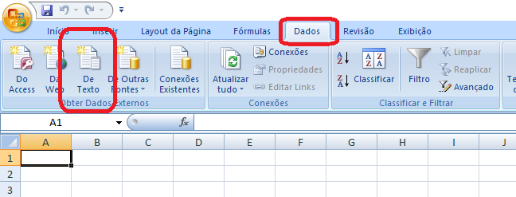
  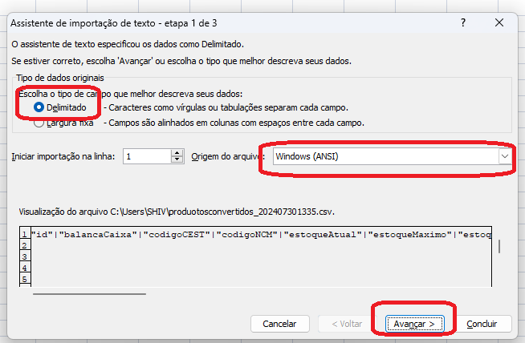
  
Insira o delimitador, ou seja, insira o caractere que informa o limite entre cada dado.

  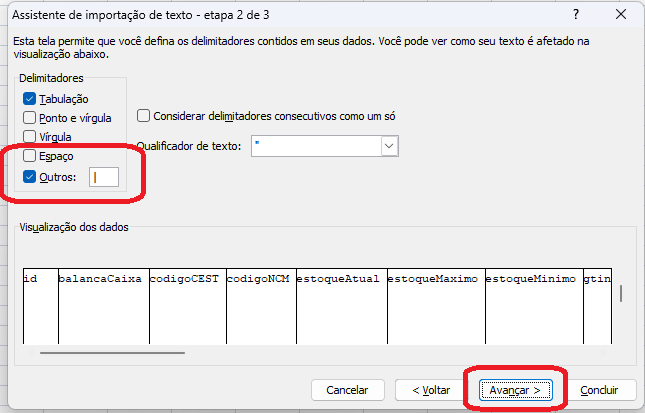
  
Marque tudo como Texto.

  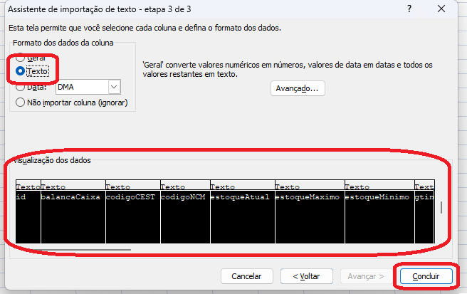
  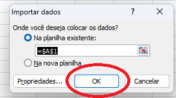
  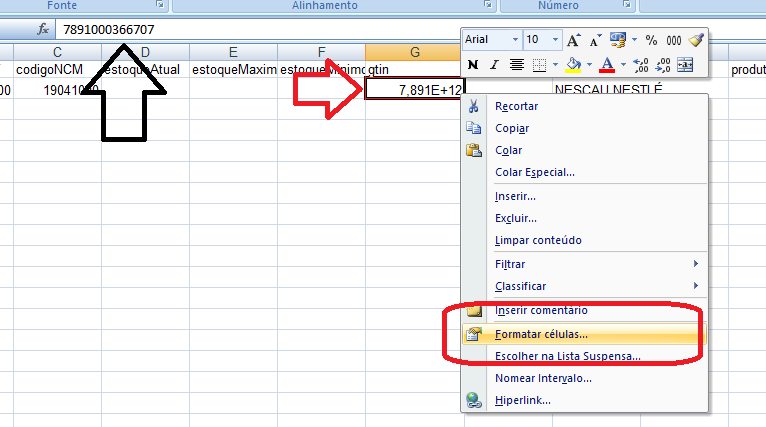
  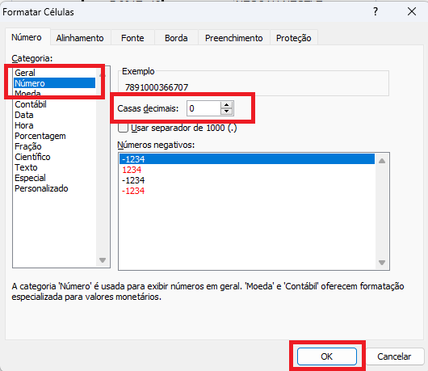
  
No caso de valores, como Valor de Compra, Custo e Venda. Recomendo que seja feito o seguinte:

  
Primeiro, selecione as células e formate as células para 2 casas decimais.

  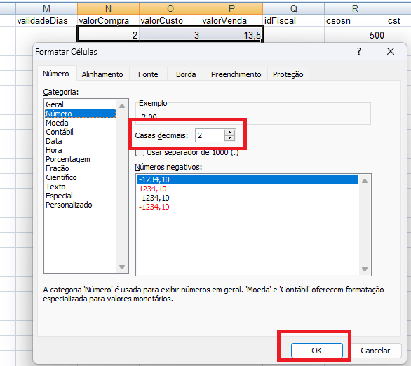
  
Depois disso, digite 1 em uma célula qualquer (ou pegue de outra celula). Selecione os campos com valores, clique com o botão direito e vá em <strong>Colar Especial</strong> selecione a opção <strong>Multiplicação</strong> e clique em <strong>OK</strong>. Após isso, pode excluir o digito 1 da célula que você inseriu.

  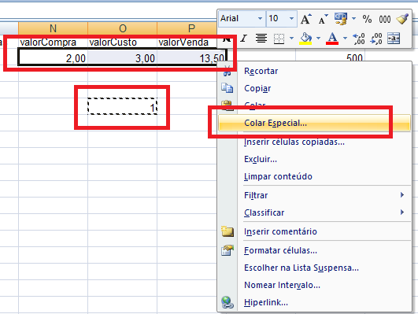
  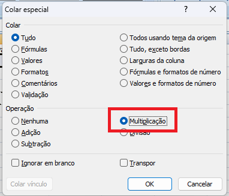
  
Agora você pode importar como Excel no MySQL Front e prosseguir normalmente.

  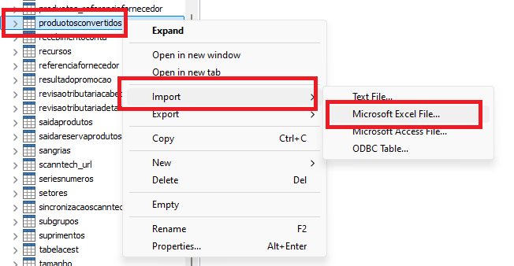

 

---

* [Voltar para a Documentação](../README.md)