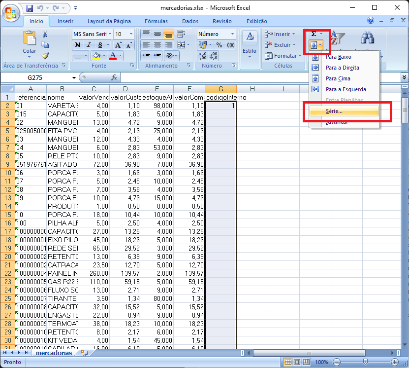
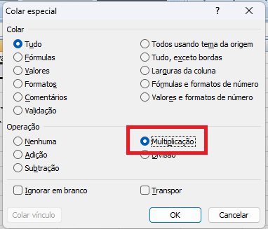

## Manual de Importação Excel

### Faça Download do Arquivo Excel:
* [Download Template Excel](https://www.dropbox.com/scl/fi/w5akh23l2oradykhttdfg/produotopadrao.zip?rlkey=xeqqrgqf8qwid6qmd45n0sqwp&dl=0)

* Insira os Dados na Planilha em Excel

* Em seguida, exclua as linhas que sobraram.

### Como Importar Arquivo Excel no Gestão Fácil (Sem utilizar o template):

  
Siga o passo a passo das imagens:

  
  
Crie um campo chamado codigoInterno e digite 1 na celula de baixo.

  
Selecione todas as linhas e vá em Preencher > Série, em seguida clique em OK.

  ## Realize o tratamento nos demais dados (Caso necessário).
  
  
  
No caso de valores, como Valor de Compra, Custo e Venda. Recomendo que seja feito o seguinte:

  
Primeiro, selecione as células e formate as células para 2 casas decimais.

  
  
Depois disso, digite 1 em uma célula qualquer (ou pegue de outra celula). Selecione os campos com valores, clique com o botão direito e vá em <strong>Colar Especial</strong> selecione a opção <strong>Multiplicação</strong> e clique em <strong>OK</strong>. Após isso, pode excluir o digito 1 da célula que você inseriu.

  
  
  
Agora você pode importar como Excel no MySQL Front e prosseguir normalmente.

  

 

---

* [Voltar para a Documentação Principal](/README.md)